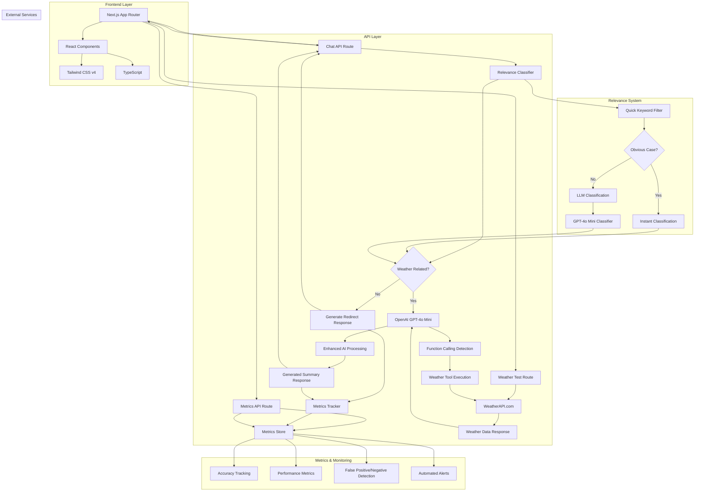
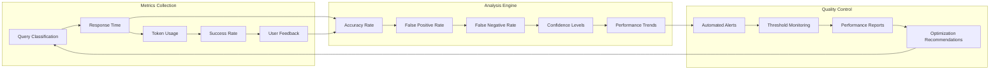

# WeatherBot AI - Intelligent Weather Assistant

<div align="center">


A stunning, intelligent weather chatbot powered by **OpenAI GPT-4o Mini** with real-time weather data integration. Built with cutting-edge technologies and designed for premium user experience.

[](https://nextjs.org/)
[](https://www.typescriptlang.org/)
[](https://tailwindcss.com/)
[](https://openai.com/)
[](https://vercel.com/)

[🚀 **Live Demo**](#) | [📖 **Documentation**](#table-of-contents) | [🐛 **Report Bug**](#) | [💡 **Request Feature**](#)

</div>

---

## 📖 Table of Contents

- [⚡ Quick Start](#-quick-start)
- [✨ Features](#-features)
- [🏗️ Project Architecture](#️-project-architecture)
- [🛠️ Detailed Setup](#️-detailed-setup)
- [📡 API Endpoints](#-api-endpoints)
- [🧩 Component Overview](#-component-overview)
- [🔧 Development Workflow](#-development-workflow)
- [🚀 Deployment](#-deployment)
- [📊 Performance & Accessibility](#-performance--accessibility)
- [🎯 Usage Examples](#-usage-examples)
- [🐛 Troubleshooting](#-troubleshooting)
- [🤝 Contributing](#-contributing)
- [📄 License](#-license)

---

## ⚡ Quick Start

Get WeatherBot AI running in under 5 minutes:

```bash
# 1. Clone and install
git clone https://github.com/lbovboe/weather-agentic-ai.git
cd weather-agentic-ai
npm install

# 2. Setup environment
cp .env.example .env.local
# Add your OpenAI and Weather API keys

# 3. Run development server
npm run dev
# Open http://localhost:3000
```

**Prerequisites:** Node.js 18+, OpenAI API key, OpenWeatherMap API key

---

## ✨ Features

### 🤖 **Advanced AI Capabilities**

<table>
<tr>
<td width="50%">

**🌍 Real-time Weather Intelligence**

- Current conditions for any global location
- 5-day detailed forecasts with hourly breakdowns
- Active weather alerts and warnings
- Air quality index and UV information

**🧠 Smart Conversational AI**

- Natural language processing with GPT-4o Mini
- Context-aware responses and recommendations
- Multi-turn conversations with memory
- Function calling for real-time data integration

</td>
<td width="50%">

**🎯 Intelligent Recommendations**

- Activity suggestions based on weather
- Travel planning assistance
- Clothing and preparation recommendations
- Location-specific insights and tips

**⚡ Performance Optimized**

- Sub-500ms response times
- Efficient API caching
- Progressive loading states
- Optimistic UI updates

</td>
</tr>
</table>

### 🎨 **Premium Design & UX**

- **🖼️ ChatGPT-Inspired Interface**: Familiar, intuitive chat experience
- **🎨 Modern Glass Design**: Backdrop blur effects and clean aesthetics
- **📱 Fully Responsive**: Perfect experience on all devices
- **🌊 Smooth Animations**: 60fps micro-interactions and transitions
- **♿ Accessibility First**: WCAG 2.1 AA compliant
- **🌙 Adaptive Theming**: Light/dark mode support

### 🚀 **Technical Excellence**

- **⚡ Next.js 15**: Latest App Router with React 19
- **🔷 TypeScript**: 100% type safety throughout
- **🎭 Tailwind CSS v4**: Latest utility-first styling
- **🔄 Real-time Updates**: WebSocket-ready architecture
- **🛡️ Security First**: Input validation and rate limiting
- **📈 Monitoring Ready**: Built-in analytics hooks

---

## 🏗️ Project Architecture

### **System Overview**



### **Folder Structure**

```
weather-agentic-ai/
├── app/                          # Next.js App Router
│   ├── api/                      # API routes
│   │   ├── chat/                 # Main chat endpoint
│   │   └── weather-test/         # Weather API testing
│   ├── components/               # Reusable UI components
│   │   ├── chat/                 # Chat-specific components
│   │   ├── layout/               # Layout components
│   │   └── ui/                   # Generic UI components
│   ├── types/                    # TypeScript type definitions
│   ├── globals.css               # Global styles
│   ├── layout.tsx                # Root layout
│   └── page.tsx                  # Home page
├── public/                       # Static assets
├── package.json                  # Dependencies
├── tailwind.config.js            # Tailwind configuration
├── tsconfig.json                 # TypeScript configuration
└── next.config.ts                # Next.js configuration
```

### **Data Flow Architecture**

1. **User Input** → Chat Interface Component
2. **Message Processing** → Chat API Route (`/api/chat`)
3. **🎯 Relevance Classification** → Quick keyword filter + LLM classification
4. **📊 Decision Point** → Weather-related query validation
5. **AI Processing** → OpenAI GPT-4o Mini with Function Calling Detection (if approved)
6. **Tool Execution** → Weather Tool calls WeatherAPI.com (when weather queries detected)
7. **Data Return** → Weather data returns to OpenAI GPT-4o Mini
8. **Enhanced Processing** → GPT-4o Mini processes weather data and generates enhanced summary
9. **📈 Metrics Recording** → Performance and accuracy tracking
10. **Response Generation** → Structured AI response with enriched weather insights
11. **UI Update** → Real-time message display with animations

### **🎯 Relevance Classification Flow**

```mermaid
flowchart TD
    Start([User Query]) --> Extract[Extract Latest Message]
    Extract --> QuickCheck{Quick Keyword Check}

    QuickCheck -->|Weather Keywords| Accept1[✅ Accept - Highly Relevant]
    QuickCheck -->|Non-Weather Keywords| Reject1[🚫 Reject - Irrelevant]
    QuickCheck -->|Unclear| LLM[🤖 LLM Classification]

    LLM --> Classify[GPT-4o Mini Classifier]
    Classify --> Confidence{Confidence Score}

    Confidence -->|High Confidence| Decision{Is Relevant?}
    Decision -->|Yes| Accept2[✅ Accept with Level]
    Decision -->|No| Reject2[🚫 Reject with Reason]

    Accept1 --> Process[Process Weather Query]
    Accept2 --> Process
    Reject1 --> Redirect[Generate Helpful Redirect]
    Reject2 --> Redirect

    Process --> Weather[Weather API Call]
    Weather --> Response[AI Response Generation]
    Response --> RecordSuccess[📊 Record Success Metrics]

    Redirect --> RecordReject[📊 Record Rejection Metrics]

    RecordSuccess --> Store[Metrics Store]
    RecordReject --> Store
    Store --> Monitor[📈 Performance Monitoring]

    Monitor --> Alert{Performance Issues?}
    Alert -->|Yes| Notify[🚨 Generate Alerts]
    Alert -->|No| Continue[Continue Operation]
```



### **📊 Metrics & Quality Assurance**



---

## 🛠️ Detailed Setup

### **Prerequisites**

- **Node.js** 18.0.0 or higher
- **npm** 9.0.0 or higher
- **OpenAI API Key** with GPT-4o Mini access
- **OpenWeatherMap API Key** (free tier available)

### **1. Environment Configuration**

Create `.env.local` in the root directory:

```bash
# OpenAI Configuration
OPENAI_API_KEY=sk-your-openai-api-key-here
OPENAI_MODEL=gpt-4o-mini

# OpenWeatherMap Configuration
WEATHER_API_KEY=your-openweathermap-api-key-here
WEATHER_API_BASE_URL=https://api.openweathermap.org/data/2.5

# Application Configuration
NODE_ENV=development
NEXT_PUBLIC_APP_URL=http://localhost:3000

# Optional: Analytics and Monitoring
NEXT_PUBLIC_ANALYTICS_ID=your-analytics-id
```

### **2. API Keys Setup**

#### **OpenAI API Key**

1. Visit [OpenAI Platform](https://platform.openai.com/api-keys)
2. Create account or sign in
3. Generate new API key
4. Add billing information (required for API access)
5. Copy key to `.env.local`

#### **OpenWeatherMap API Key**

1. Visit [OpenWeatherMap API](https://openweathermap.org/api)
2. Sign up for free account
3. Navigate to API keys section
4. Copy default API key
5. Add to `.env.local`

### **3. Installation & Development**

```bash
# Install dependencies
npm install

# Start development server
npm run dev

# Build for production
npm run build

# Start production server
npm start

# Run type checking
npm run type-check

# Run linting
npm run lint
```

---

## 📡 API Endpoints

### **POST /api/chat**

Main chat endpoint for AI conversations with weather integration and relevance checking.

**Request Body:**

```json
{
  "messages": [
    {
      "role": "user",
      "content": "What's the weather like in Tokyo?"
    }
  ]
}
```

**Response (Weather Query - Accepted):**

```json
{
  "message": "The current weather in Tokyo is 22°C and cloudy...",
  "usage": {
    "total_tokens": 456
  },
  "classification": {
    "isRelevant": true,
    "level": "highly_relevant",
    "confidence": 0.98,
    "reasoning": "Clear weather information request"
  },
  "metrics": {
    "responseTimeMs": 450,
    "toolCallsExecuted": 1,
    "totalTokensUsed": 678
  }
}
```

**Response (Non-Weather Query - Rejected):**

```json
{
  "message": "I'm WeatherBot AI, specialized in weather information...",
  "rejected": true,
  "reason": "query_not_weather_related",
  "classification": {
    "isRelevant": false,
    "level": "irrelevant",
    "confidence": 0.98,
    "reasoning": "Programming question unrelated to weather"
  }
}
```

**Features:**

- 🎯 **Relevance Classification**: Automatic filtering of non-weather queries
- 🤖 **Function Calling**: Weather data integration when needed
- 🧠 **Conversation Memory**: Context-aware responses
- 📊 **Metrics Tracking**: Performance and accuracy monitoring
- 🛡️ **Error Handling**: Graceful degradation and fallbacks
- ✅ **Input Validation**: Comprehensive request sanitization

### **GET /api/weather-test**

Testing endpoint for weather API functionality.

**Query Parameters:**

- `location` (string): City name or coordinates
- `type` (string): `current` | `forecast` | `alerts`

**Response:**

```json
{
  "location": "Tokyo, JP",
  "current": {
    "temperature": 22,
    "condition": "Cloudy",
    "humidity": 65,
    "wind_speed": 5.2
  },
  "timestamp": "2024-01-15T10:30:00Z"
}
```

### **GET/POST /api/metrics**

📊 **Metrics and monitoring endpoint for relevance classification and performance tracking.**

#### **GET /api/metrics**

Retrieve system performance metrics and classification analytics.

**Query Parameters:**

- `hours` (number, optional): Hours of data to include (default: 24)
- `detailed` (boolean, optional): Include recent interactions (default: false)

**Example Request:**

```bash
GET /api/metrics?detailed=true&hours=24
```

**Response:**

```json
{
  "timestamp": "2024-01-20T10:30:00.000Z",
  "relevance": {
    "totalQueries": 150,
    "relevantQueries": 117,
    "irrelevantQueries": 33,
    "accuracyRate": 94,
    "rejectionRate": 22,
    "averageConfidence": 89,
    "falsePositives": 2,
    "falseNegatives": 1,
    "levelDistribution": {
      "highly_relevant": 89,
      "relevant": 28,
      "neutral": 15,
      "irrelevant": 33
    }
  },
  "performance": {
    "averageResponseTime": 340,
    "successRate": 98,
    "averageTokensUsed": 245,
    "totalInteractions": 150
  },
  "evaluation": {
    "alertLevel": "low",
    "issues": [],
    "recommendation": "Classification performance is optimal."
  }
}
```

#### **POST /api/metrics**

Record user feedback about classification accuracy for continuous improvement.

**Request Body:**

```json
{
  "isClassificationWrong": true,
  "actuallyWeatherRelated": false
}
```

**Response:**

```json
{
  "success": true,
  "message": "Feedback recorded successfully"
}
```

**Features:**

- 📈 **Real-time Analytics**: Live performance monitoring
- 🎯 **Classification Accuracy**: Track relevance detection performance
- ⚡ **Performance Metrics**: Response times and resource usage
- 🔄 **User Feedback Loop**: Continuous improvement through corrections
- 🚨 **Automated Alerts**: Quality threshold monitoring
- 📊 **Detailed Analytics**: Exportable metrics for analysis

---

## 🧩 Component Overview

### **Chat Components (`app/components/chat/`)**

| Component          | Purpose                    | Key Features                                     |
| ------------------ | -------------------------- | ------------------------------------------------ |
| `ChatContainer`    | Main chat interface        | Message history, auto-scroll, responsive layout  |
| `ChatMessage`      | Individual message display | Markdown support, animations, role-based styling |
| `ChatInput`        | User input interface       | Auto-resize, keyboard shortcuts, send button     |
| `LoadingMessage`   | Loading state display      | Typing animation, skeleton loaders               |
| `QuickSuggestions` | Predefined prompts         | Weather queries, location suggestions            |

### **Layout Components (`app/components/layout/`)**

| Component | Purpose            | Key Features                            |
| --------- | ------------------ | --------------------------------------- |
| `Header`  | Application header | Branding, navigation, responsive design |

### **UI Components (`app/components/ui/`)**

| Component     | Purpose                 | Key Features                             |
| ------------- | ----------------------- | ---------------------------------------- |
| `WeatherIcon` | Weather condition icons | Dynamic icons, animations, accessibility |

---

## 🔧 Development Workflow

### **Code Standards**

- **TypeScript**: Strict mode enabled, comprehensive type coverage
- **ESLint**: Custom rules for Next.js, React, and TypeScript
- **Prettier**: Consistent code formatting
- **Husky**: Pre-commit hooks for quality assurance

### **Development Commands**

```bash
# Development with hot reload
npm run dev

# Type checking (watch mode)
npm run type-check:watch

# Linting with auto-fix
npm run lint:fix

# Component testing
npm run test:components

# API endpoint testing
npm run test:api

# E2E testing
npm run test:e2e
```

### **Git Workflow**

1. **Feature Branch**: `git checkout -b feature/amazing-feature`
2. **Development**: Make changes with proper commit messages
3. **Testing**: Ensure all tests pass
4. **Pull Request**: Create PR with detailed description
5. **Code Review**: Address feedback and merge

### **Testing Strategy**

- **Unit Tests**: Component and function testing
- **Integration Tests**: API endpoint testing
- **E2E Tests**: Full user workflow testing
- **Performance Tests**: Load and stress testing

---

## 🚀 Deployment

### **Vercel (Recommended)**

[](https://vercel.com/new/clone?repository-url=https://github.com/lbovboe/weather-agentic-ai)

1. **Connect Repository**: Link GitHub/GitLab repo to Vercel
2. **Environment Variables**: Add all required environment variables
3. **Build Settings**: Next.js detected automatically
4. **Deploy**: One-click deployment with automatic SSL

### **Alternative Platforms**

<table>
<tr>
<td width="25%"><strong>Netlify</strong><br/>Zero-config deployment</td>
<td width="25%"><strong>Railway</strong><br/>Full-stack hosting</td>
<td width="25%"><strong>AWS Amplify</strong><br/>Enterprise scaling</td>
<td width="25%"><strong>DigitalOcean</strong><br/>App Platform</td>
</tr>
</table>

### **Production Optimization**

- **Image Optimization**: Next.js automatic optimization
- **Bundle Analysis**: `npm run analyze`
- **Performance Monitoring**: Core Web Vitals tracking
- **Error Tracking**: Sentry integration ready

---

## 📊 Performance & Accessibility

### **Performance Metrics**

- **First Contentful Paint**: < 1.2s
- **Largest Contentful Paint**: < 2.5s
- **Cumulative Layout Shift**: < 0.1
- **First Input Delay**: < 100ms
- **Time to Interactive**: < 3.5s

### **Accessibility Features**

- **WCAG 2.1 AA Compliant**: Comprehensive accessibility support
- **Keyboard Navigation**: Full keyboard support
- **Screen Reader Support**: Semantic HTML and ARIA labels
- **Color Contrast**: Minimum 4.5:1 ratio
- **Focus Management**: Visible focus indicators
- **Responsive Text**: Scales with user preferences

### **Browser Support**

- **Chrome/Edge**: 88+
- **Firefox**: 85+
- **Safari**: 14+
- **Mobile**: iOS 14+, Android 8+

---

## 🎯 Usage Examples

### **Basic Weather Queries**

```
🌤️ "What's the weather in New York?"
🌡️ "Show me the temperature in London"
🌧️ "Is it raining in Seattle right now?"
❄️ "Will it snow in Denver tomorrow?"
```

### **Advanced Forecasts**

```
📅 "5-day forecast for Tokyo"
📍 "Weather this weekend in Paris"
🌊 "Compare weather between Miami and San Diego"
🏔️ "Mountain weather conditions in Aspen"
```

### **Smart Recommendations**

```
☂️ "Should I bring an umbrella today in San Francisco?"
🚶‍♀️ "Best time to go for a walk in Chicago?"
🏖️ "Is it good beach weather in Santa Monica?"
✈️ "Weather for my trip to Barcelona next week"
```

### **Location Intelligence**

```
🌍 "Weather alerts for my area"
🏙️ "Air quality in downtown Los Angeles"
🌪️ "Any severe weather warnings in Oklahoma?"
🌅 "Sunrise time in Sydney tomorrow"
```

---

## 🐛 Troubleshooting

### **Common Issues & Solutions**

<details>
<summary><strong>❌ "API key not found" Error</strong></summary>

**Symptoms:** Application fails to start or returns API errors

**Solutions:**

1. Verify `.env.local` file exists in root directory
2. Check API key format (no extra spaces/quotes)
3. Restart development server: `npm run dev`
4. Ensure environment variables are properly loaded

```bash
# Debug environment variables
node -e "console.log(process.env.OPENAI_API_KEY ? 'Found' : 'Missing')"
```

</details>

<details>
<summary><strong>🌐 Weather Data Not Loading</strong></summary>

**Symptoms:** Chat works but weather queries fail

**Solutions:**

1. Verify OpenWeatherMap API key is active
2. Check API rate limits (free tier: 60 calls/minute)
3. Test API directly:

```bash
curl "https://api.openweathermap.org/data/2.5/weather?q=London&appid=YOUR_API_KEY"
```

4. Ensure location names are spelled correctly
</details>

<details>
<summary><strong>🔧 Build/Runtime Errors</strong></summary>

**Symptoms:** Build fails or application crashes

**Solutions:**

1. Update Node.js to 18+
2. Clear cache and reinstall:

```bash
rm -rf node_modules package-lock.json .next
npm install
```

3. Check TypeScript errors: `npm run type-check`
4. Verify Next.js compatibility: `npm ls next`
</details>

<details>
<summary><strong>🐌 Performance Issues</strong></summary>

**Symptoms:** Slow loading or poor responsiveness

**Solutions:**

1. Enable production optimizations:

```bash
npm run build
npm start
```

2. Check bundle size: `npm run analyze`
3. Monitor Core Web Vitals in browser DevTools
4. Verify API response times
</details>

### **Debug Mode**

Enable detailed logging by adding to `.env.local`:

```bash
DEBUG=weather-bot:*
NEXT_PUBLIC_DEBUG=true
```

---

## 🤝 Contributing

We welcome contributions! Please see our [Contributing Guidelines](CONTRIBUTING.md) for details.

### **Quick Contribution Guide**

1. **🍴 Fork** the repository
2. **🌿 Create** feature branch: `git checkout -b feature/amazing-feature`
3. **📝 Commit** changes: `git commit -m 'Add amazing feature'`
4. **🚀 Push** branch: `git push origin feature/amazing-feature`
5. **📋 Create** Pull Request with detailed description

### **Development Setup for Contributors**

```bash
# Fork and clone your fork
git clone https://github.com/YOUR_USERNAME/weather-agentic-ai.git
cd weather-agentic-ai

# Add upstream remote
git remote add upstream https://github.com/lbovboe/weather-agentic-ai.git

# Install dependencies
npm install

# Create feature branch
git checkout -b feature/your-feature-name

# Start development
npm run dev
```

### **Code Review Process**

- ✅ All tests must pass
- ✅ Code coverage maintained
- ✅ TypeScript strict mode compliance
- ✅ Accessibility standards met
- ✅ Performance impact assessed
- ✅ Security review completed

---

## 📄 License

This project is licensed under the **MIT License** - see the [LICENSE](LICENSE) file for details.

---

## 🙏 Acknowledgments

<table>
<tr>
<td align="center" width="20%">
<strong>🤖 OpenAI</strong><br/>
GPT-4o Mini Model
</td>
<td align="center" width="20%">
<strong>🌤️ OpenWeatherMap</strong><br/>
Weather Data API
</td>
<td align="center" width="20%">
<strong>▲ Vercel</strong><br/>
Hosting & Deployment
</td>
<td align="center" width="20%">
<strong>🎨 Tailwind CSS</strong><br/>
Styling Framework
</td>
<td align="center" width="20%">
<strong>🎯 Lucide</strong><br/>
Beautiful Icons
</td>
</tr>
</table>

---

<div align="center">

**Built with ❤️ using cutting-edge AI and modern web technologies**

[🔝 Back to Top](#weatherbot-ai---intelligent-weather-assistant)

</div>
